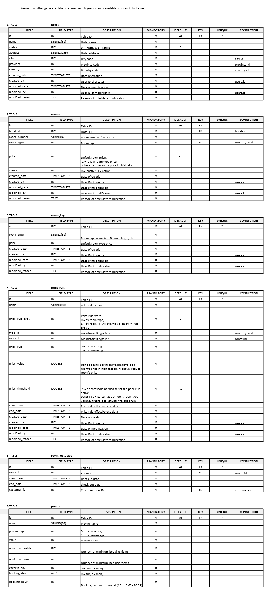
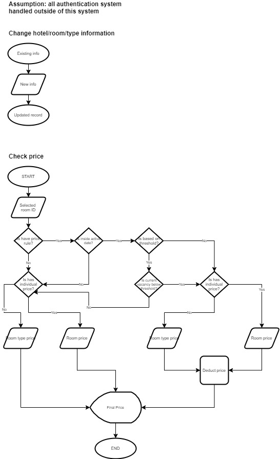

# Faiz-Hotel

Faiz Hotel is Go Lang API test project

  - Database Design
  - Flowchart
  - API Promotion Service + Postman Collection

# Database Design and Flowchart
Database design available on [Database Design.xml](DatabaseDesign.xml) file or image below:


Flowchart for information change and check price available on image below:


# API Promotion Service

API developed in golang, listen to port 8080. Output is in JSON format. Database table design used on this API service are rooms and promo Available functions under this API service are:

* [Get All Rooms](#Get-All-Room) - Get all rooms information
* [Get Single Room](#Get-Single-Room) - Get single room information by ID
* [Promo](#Promo) - Get list of price, total price, and total promo
 
## Sample Data

I have created sample data for rooms and promos as follow:
#### Room
| id | room_number | room_type | price |
| -- | ---------- | ---------- | ----- |
| 1 | 2001 | 1 | -1 |
| 2 | 2002 | 1 | -1 |

#### Promo
| id | name | promo_type | value | minimum_nights | minimum_rooms | checkin_day | booking_day | booking_hour |
| -- | ---- | ---------- | ----- | -------------- | ------------- | ----------- | ----------- | ------------ |
| 1 | Monday Promo | 0 | 1000 | 1 | 1 | [1] | [1] | [10] |
| 2 | Weekend Promo | 1 | 10 | 2 | 2 | [0,6] | [0,1,2,3,4,5,6] | [23]
 
## Available Functions

#### Get All Room

Get all rooms information.

```sh
localhost:8080/rooms
```

Sample output:

```sh
[
    {
        "id": 1,
        "room_number": "2001",
        "room_type": 1,
        "price": -1
    },
    {
        "id": 2,
        "room_number": "2002",
        "room_type": 1,
        "price": -1
    }
]
```

#### Get Single Room

Get all single information by ID.

```sh
localhost:8080/room/{id}
```

Sample output:

```sh
{
    "id": 1,
    "room_number": "2001",
    "room_type": 1,
    "price": -1
}
```

#### Promo

Get list of price, total price, and total promo. There are three parameters required.

```sh
localhost:8080/promo
```

Parameter required:
| Variable | Description | Sample |
| -------- | ----------- | ---- |
| price | list of price, can be single or multiple (counted as number of rooms) | 10000,20000 |
| total | total of price | 30000 |
| promo_id | promo id, taken from promo table's ID | 1 |
| days | 1 | number of nights beetwen checkin to checkout | 1 |

Sample output:

```sh
{
    "list": "9000,19000",
    "promo": 28000,
    "final": 28000
}
```

### Dependency

 - [Gorrila Mux](https://github.com/gorilla/mux)
